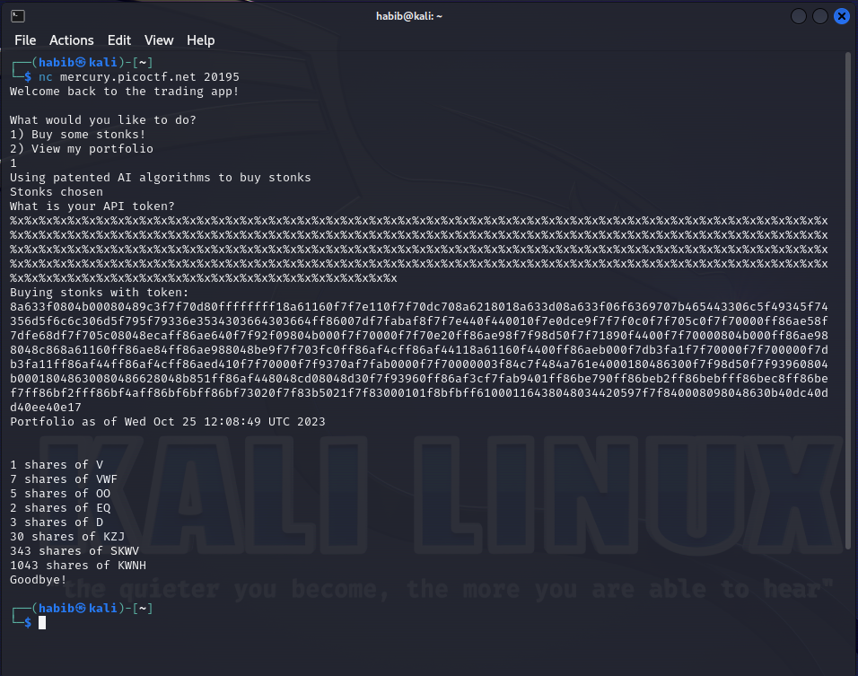
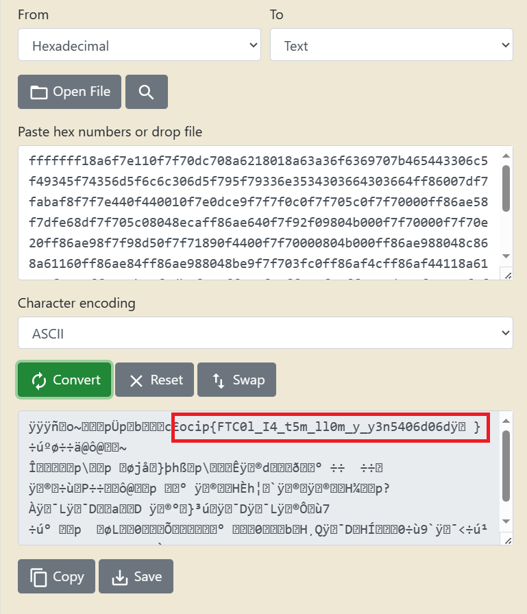

<h2>Description: <br><br> </h2>
<h3>I decided to try something noone else has before. I made a bot to automatically trade stonks for me using AI and machine learning. I wouldn't believe you if you told me it's unsecure!</h3>


`nc mercury.picoctf.net 20195`

<h4>In the given code "vuln.c" there is a function named buy_stonks.</h4>

```c
int buy_stonks(Portfolio *p) {
	if (!p) {
		return 1;
	}
	char api_buf[FLAG_BUFFER];
	FILE *f = fopen("api","r");
	if (!f) {
		printf("Flag file not found. Contact an admin.\n");
		exit(1);
	}
	fgets(api_buf, FLAG_BUFFER, f);

	int money = p->money;
	int shares = 0;
	Stonk *temp = NULL;
	printf("Using patented AI algorithms to buy stonks\n");
	while (money > 0) {
		shares = (rand() % money) + 1;
		temp = pick_symbol_with_AI(shares);
		temp->next = p->head;
		p->head = temp;
		money -= shares;
	}
	printf("Stonks chosen\n");

	// TODO: Figure out how to read token from file, for now just ask

	char *user_buf = malloc(300 + 1);
	printf("What is your API token?\n");
	scanf("%300s", user_buf);
	printf("Buying stonks with token:\n");
	printf(user_buf);

	// TODO: Actually use key to interact with API

	view_portfolio(p);

	return 0;
}
```

<h3>If you look closely at the print on third last line, it says "printf(user_buf)" which is a format string vulnerability. So, what is being inputted as api token in "scanf("%300s", user_buf)", is intended to print on that printf line. But as there is no formatting specified in printf, if we input a format, say "%d" the program will be executed like printf(%d), which will potentially print a memory location. This vulnurability can be exploited. If we use "%x" a lot of times, potentially everything inside of stack is gonna be printed. And we know from the function that the flag is being stored in that stack.</h3><br>



<h3>Now you can see we got some hex value as return. Now supposedly, this hex values can contain characters. So now we gotta convert these hex values to ASCII.</h3><br>



<h3>See this? Looks like a flag but something is wrong right? Just seperate them into 4 character words and write them backwords.
<br>
ocip{FTC0l_I4_t5m_ll0m_y_y3n5406d06dÿ†}
<br>Remove the last two characters that looks like some alien thing.
<br>
ocip{FTC0l_I4_t5m_ll0m_y_y3n5406d06d}
<br> Now write them into 4 character segments.
<br>
ocip<br>
{FTC<br>
0l_I<br>
4_t5<br>
m_ll<br>
0m_y<br>
_y3n<br>
5406<br>
d06d<br>
}<br> <br>
Now write them backwords.<br>
pico<br>
CTF{<br>
I_l0<br>
5t_4<br>
ll_m<br>
y_m0<br>
n3y_<br>
6045<br>
d60d<br>
}<br><br>
Now the final flag is: picoCTF{I_l05t_4ll_my_m0n3y_6045d60d}